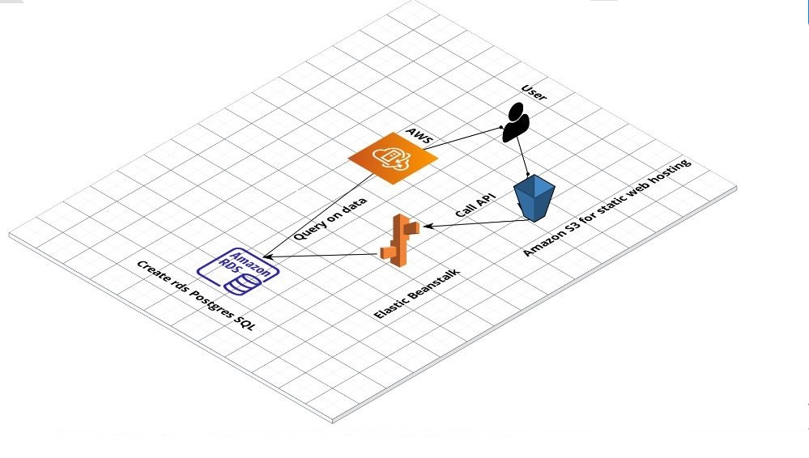

## Udagram 

# AWS

##S3
S3-Bucket url : `http://bucketdeploment.s3-website-us-east-1.amazonaws.com/`

## RDS database
Database endpoint: `database-1.ciphti5em2y2.us-east-1.rds.amazonaws.com`

## Elastic Beanstalk

 EB url : `http://Appbackend-env.eba-fewmvdmm.us-east-1.elasticbeanstalk.com/`

