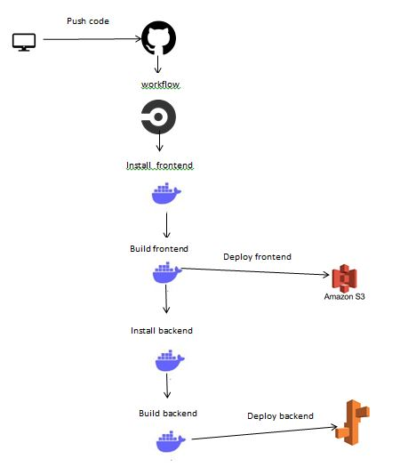

## Pipeline Architecture

The main `package.json` have the pipeline process.

`npm run frontend:install` -> install frontend dependencies.
`npm run frontend:build` -> build frontend.
`npm run frontend:deploy` -> deploy the project to S3 using `./udagram-frontend/bin/deploy.sh`.
`npm run backend:install` -> install backend dependencies. `npm run backend:build` -> build backend generate ./WWW folder.
`npm run backend:deploy` -> deploy to Elasticbeanstalk using `./udagram-api/bin/deploy.sh`.
